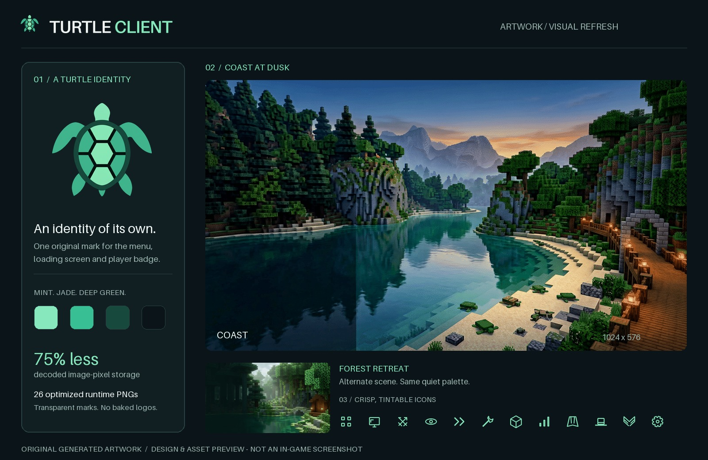

# TurtleClient visual refresh

## Original identity

The turtle emblem and both landscape masters were generated specifically for
TurtleClient. No Lunar Client logos, branded panorama screenshots, screenshot-sized
button images, or modified Mojang/title atlases remain in the menu resources.
The vanilla title atlas overrides were removed; the client renders its own brand
through its existing loading/menu hooks instead.

- **Turtle emblem:** mint, jade, and deep-green shell; transparent PNGs at 256px
  (menu/loading), 128px (mod icon), and 64px (in-world name badge).
- **Wordmark:** clean typeset lettering, 512 × 96, with transparency. It is typeset
  during preparation using Pillow's bundled Aileron font, not generated lettering;
  no additional font binary or runtime font renderer is bundled.
- **Coast / Forest:** two original 1024 × 576 backgrounds, with no baked branding
  or interface. The renderer uses aspect-preserving cover/crop, not stretched
  square cubemap faces. Only one scene is drawn per frame.
- **Icons:** a coherent set of antialiased 32px monochrome glyphs, tinted by the UI.
  Controls no longer depend on unsupported emoji or large image-backed buttons.

## Optimization

`scripts/prepare_ui_assets.py` requires Python and Pillow >= 10. Pass a directory
containing `emblem-master.png`, `coast-master.png`, and `forest-master.png`. Large
masters are intentionally kept outside the repository and are not included in jars.
The runtime PNGs are the deliverables and are checked into the repository.

The script strips metadata, removes the emblem's background/matte fringe, resizes
with Lanczos filtering, uses a dithered 256-color palette for the backgrounds, and
writes maximum-compression PNGs. Minecraft texture metadata enables linear
filtering and edge clamping. The manifest at
`assets/turtle-client/ui-assets.json` records dimensions, sizes, and SHA-256 hashes.

Compared with the previous bundled PNG set:

- Compressed PNG data is approximately **two-thirds smaller**.
- Total decoded RGBA pixel storage falls from **20.3 MiB to 5.1 MiB** (about **75%
  less**). This is an image-pixel budget, not a claim about total Minecraft VRAM.
- Each background is capped at 400 KB; all new UI PNGs together stay below 900 KB.

`UiAssetsTest` checks image readability, hashes, dimensions, transparency, required
paths, filtering metadata, and these budgets in every Minecraft build target.

## Interface and input

`TurtleTheme` supplies consistent colors, rounded panels, typography fitting, and
shared artwork. Widgets are drawn procedurally and images are cached by Minecraft's
texture manager; no file decoding occurs in render loops.

`UiGrid` reflows columns to the GUI-scaled window. `ScrollState` retains fractional
wheel movement, clamps to the actual content height, and supports dragging and
keyboard paging. Modules, cosmetics, and settings use the same scroll model.
Rendering and hit testing share geometry and the same scroll offset, so clipped
rows cannot be activated through headers or footers. Returning from settings keeps
the module list's position. The settings footer/keybind controls remain fixed.
Favorited modules remain reachable through the title menu's Favorites shortcut.
Typing in a screen no longer fires module hotkeys; held keys must be released
before they can toggle modules again after closing the screen.

Cosmetics still use the existing local-file registry/equip state. This refresh does
not implement in-world cosmetic meshes; the UI no longer presents a box-drawn fake
player as a working 3D preview.

The included artwork preview is a design/asset preview, not an in-game screenshot.
