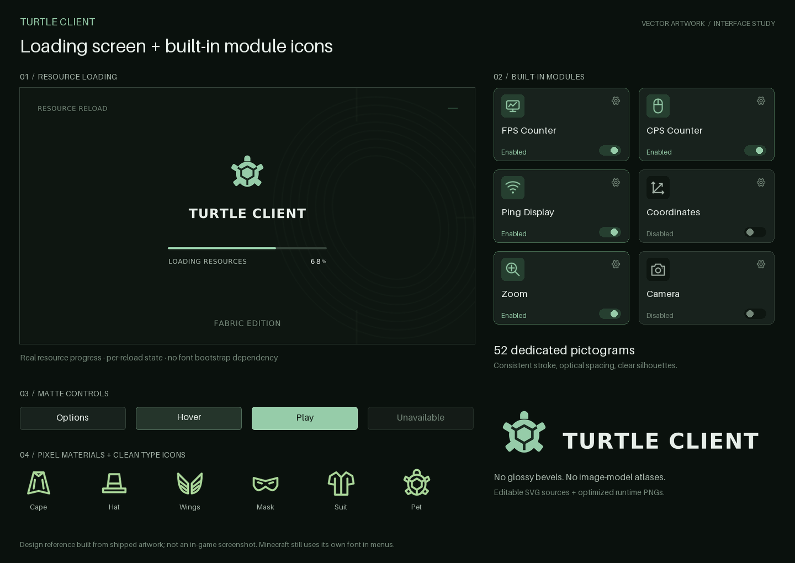

# TurtleClient — vector interface redesign



The previous image-model artwork has been replaced in the runtime resources.
The new direction is **flat, code-authored SVG artwork**, not another generated
image atlas: consistent monoline pictograms, matte button surfaces, a geometric
turtle mark, outlined typography and quiet, limited-palette landscapes.

This describes the design technique, not a claim that a human illustrator made
these files. The editable shapes are included in [`artwork/`](../artwork/).

## Loading screen

`BrandingRenderer` paints the startup/resource-reload overlay with:

- a neutral charcoal/forest palette and an original flat turtle mark;
- a restrained contour motif on larger GUI sizes;
- a real resource percentage and time-based progress smoothing;
- a fresh progress state for each overlay, including repeated **F3+T** reloads;
- no invented stages, ETA, or automatic progress while Minecraft is stalled;
- small pre-outlined caption and digit textures, so loading does not read a font
  renderer whose resources are still being reloaded.

The mixin still paints at **TAIL**. Minecraft retains ownership of its reload
completion callback, exceptions and overlay removal; rendering is not cancelled.
This redesign covers the **startup/resource-loading overlay**, not world-generation
chunk maps or server connection screens.

`LoadingLayout` adapts to GUI-scaled dimensions and suppresses corner chrome on
small windows. The mark, wordmark, progress track and status have separate bounds.

## A distinct icon for every built-in module

All **52 registered modules**, including entries labelled Unavailable, now have
their own pictogram. The library cards and settings headers use the same resolver.
FPS has a monitor/graph, CPS a mouse, coordinates axes, ping a wireless signal,
speed a gauge, memory a RAM stick, the timer a stopwatch, and so on. They no longer
all reuse their category's icon.

- SVG grid: **24 × 24**, normally a **1.65-unit** rounded stroke.
- Runtime icons: **32 × 32 RGBA**, with transparent margins and tintable linework.
- Cached identifiers; no SVG parsing or PNG decoding in the render loop.
- `ModuleIcons.kt` maps stable class identities, not displayed/translated names.
- A bytecode-based test enumerates actual registrations and requires a unique,
  present icon for each one. Cards and settings wiring are tested too.

[See all 52 module icons](turtle-module-icons.png).

Artwork does **not** change module availability. Incomplete prototypes remain
Unavailable, as documented in [the control audit](BUTTON_AUDIT.md).

## Other visual changes

- Eight flat **128 × 32** nine-slice button states and a **64 × 64** panel skin.
- A simplified original turtle emblem at 256/128/64 pixels.
- A clean wordmark; DejaVu lettering is stored as SVG outlines. Its notice is in
  `artwork/licenses/DejaVu.txt`. No font binary or custom in-game font engine ships.
- Two flat **1024 × 576** coast/forest compositions, not synthetic screenshots.
- Clean cosmetic-type previews and pixel-aligned Jade/Aurora/Ember materials.
  Existing cosmetic IDs, UV layouts, meshes and saved selections are unchanged.
- Menu labels no longer add a drop shadow; HUD shadow preferences still work.

## Rebuilding

No external image masters, image-generation service, system fonts or Cairo shared
library are needed. The old master-slicing scripts are retired.

```sh
python3 -m pip install -r scripts/artwork-requirements.txt
python3 scripts/prepare_vector_art.py
python3 scripts/prepare_vector_art.py --check
# Optional, labelled design-reference sheets (not game captures):
python3 scripts/preview_vector_art.py
```

The exporter uses pinned Pillow/resvg versions, supersamples small linework,
strips metadata, zeros transparent resampling fringes and compresses PNGs. The
manifest records output dimensions/bytes/SHA-256 **and the source SVG hash**.
SVGs and preview sheets stay outside the game jar.

### Current budget

- **139 prepared PNGs:** **177,667 compressed bytes**.
- Including the retained 1 × 1 white primitive: **140 PNGs / 177,736 bytes**.
- **7,065,348 bytes** of base RGBA pixels for all runtime PNGs (about **6.74 MiB**).
- Roughly **81% less compressed PNG data** than the preceding 954,035-byte set,
  despite adding 52 module icons and the loading assets.
- The automated compressed budget is now **250 KB**, tightened from 1.2 MB.

These are file/pixel budgets, **not measured FPS, total VRAM or GPU benchmarks**.

## Validation boundary

The PNGs and design sheets were inspected, and deterministic source/output checks
run locally. The eight-version build checks cover PNGs, icon registration/wiring,
loading bounds/progress, mixin contracts and packaged resources. **Minecraft has
not been launched in this sandbox.** Cold startup, repeated resource reloads,
resource-pack overrides, native fade/removal timing, GUI scales and actual GPU
appearance still need in-game checks.

Both sheets are explicitly **design references, not in-game screenshots**. Menus
continue to use Minecraft's own text renderer; preview-sheet captions are typeset
by the preparation script.
